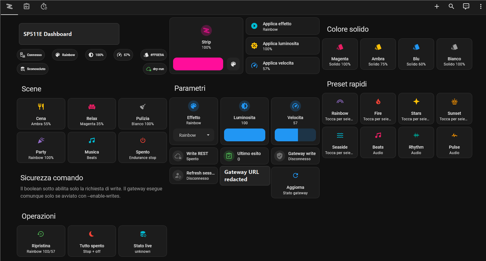
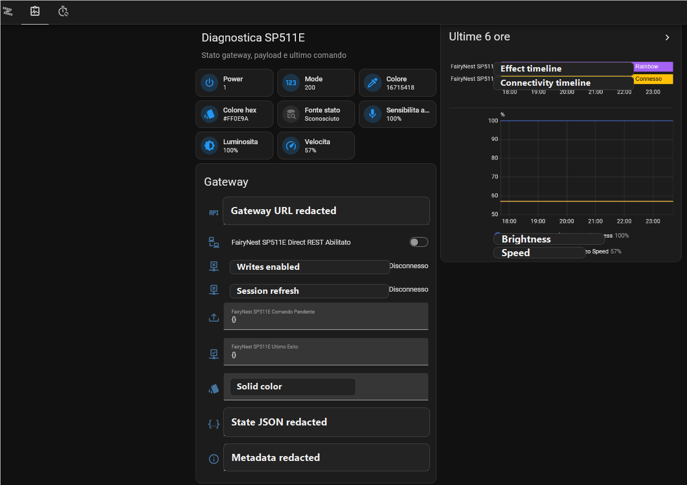
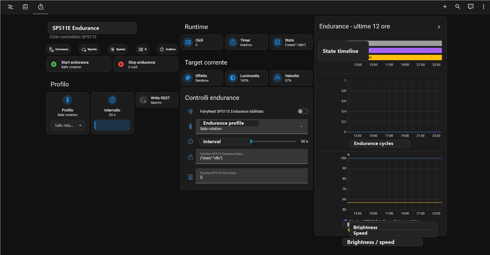

# SP511E Cloud

Home Assistant custom integration for SP511E LED strip controllers.

[](https://my.home-assistant.io/redirect/hacs_repository/?owner=zampix1&repository=ha-sp511e-cloud&category=integration)

This integration is cloud dependent. It talks to the vendor cloud API used by the official app and does not provide a local-only replacement for the controller firmware or Aliyun IoT channel.


## What Works

- `light` entity with power, RGB color, brightness, and effect support.
- 24 mapped SP511E effects.
- Native `select` entity for effects.
- Native `number` entities for brightness, speed, and music sensitivity.
- `button` entities for refresh, restore standard, and all off.
- Diagnostic sensors for current effect, color, device IP, SSID, and last command.
- Config flow login with automatic session refresh.
- Redacted diagnostics support.

## Features

The integration focuses on the SP511E cloud command path exposed by the official app. It creates Home Assistant entities for everyday control and service calls for advanced actions.

## Supported devices

Tested with:

- Official Android app package `com.spled.aicontrol`
- SP511E controller
- SP511E LED controller kit as shown above
- Firmware `1.0.2`

Other Spled/SP511E-family controllers may use similar cloud commands, but they are not supported by this integration unless explicitly tested.

## Quick start

Before installing this integration, the controller must already work in the official app and must be bound to the cloud account you will use in Home Assistant.

Requirements:

- Home Assistant with HACS installed, or filesystem access to `/config/custom_components`.
- Internet access from Home Assistant to the vendor cloud API.
- Internet access from the SP511E controller to the vendor cloud.
- Cloud account email/phone, password, and country code used by the official app.

Setup:

1. Install the integration with HACS or by manual copy.
2. Restart Home Assistant.
3. Open `Settings > Devices & services`.
4. Select `Add integration`.
5. Search for `SP511E Cloud`.
6. Enter the same account, password, and country code used in the official app.
7. Leave `Device selector` as `SP511E` unless you have multiple SP511E devices on the same account.
8. Confirm the new `light`, `select`, `number`, `button`, and diagnostic `sensor` entities are created.

After setup, use the `light` entity for power, brightness, color, and effects. Advanced actions are also exposed as Home Assistant services.

## Installation with HACS

1. Open HACS.
2. Open `Integrations`.
3. Add this repository as a custom repository.
4. Select category `Integration`.
5. Install `SP511E Cloud`.
6. Restart Home Assistant.
7. Add the integration from `Settings > Devices & services`.

## Manual installation

Copy this directory:

```text
custom_components/sp511e_cloud
```

to:

```text
/config/custom_components/sp511e_cloud
```

Restart Home Assistant and add `SP511E Cloud` from the integrations UI.

## Credentials

The integration needs the cloud account that owns the controller. Home Assistant stores the account credentials and refreshed session token in the config entry storage.

Do not publish `.storage`, diagnostic dumps, logs, tokens, or pulled app data.

## Services

- `sp511e_cloud.set_effect`
- `sp511e_cloud.set_speed`
- `sp511e_cloud.set_music_sensitivity`
- `sp511e_cloud.restore_standard`
- `sp511e_cloud.all_off`
- `sp511e_cloud.refresh`

## Effects

`rainbow`, `fire`, `stars`, `ripple`, `halloween`, `theater`, `gradient`, `gorgeous`, `romantic`, `sunshine`, `sunset`, `seaside`, `grassland`, `violet`, `crystal`, `energy`, `spectrum`, `twinkle`, `beats`, `scrolling`, `rhythm`, `blink`, `pulse`, `ejection`.

Sound-reactive effects depend on the controller microphone and are still applied through the same cloud command path.

## Example Dashboards

The screenshots below come from the validation Home Assistant dashboard used while reverse engineering the SP511E controller. They are examples only; the integration itself creates entities and services, while dashboards remain user-configurable.







## Known limitations

- Cloud dependent: no local-only runtime has been confirmed.
- If the vendor changes API signing, login, or command routing, the integration may need updates.
- Only SP511E has been validated.
- This is an unofficial integration and is not affiliated with the official app publisher, Spled, Sperll, or the device vendor.

## Privacy

Diagnostics redact account, password, session token, hashKey, deviceCode, productKey, bind token, and user identifiers.

## Development

Run static protocol tests:

```bash
python -m unittest discover -s tests
```

Run HACS and hassfest checks through the GitHub Actions included in this repository.
